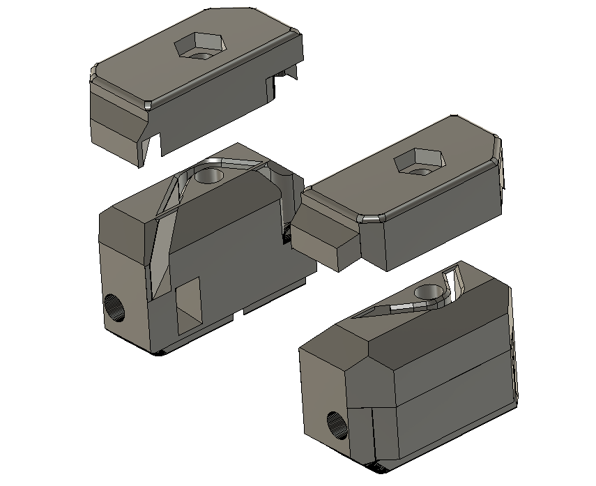
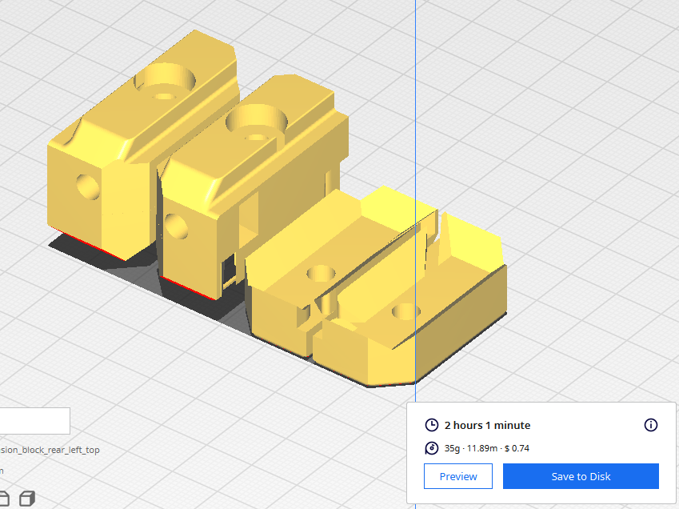
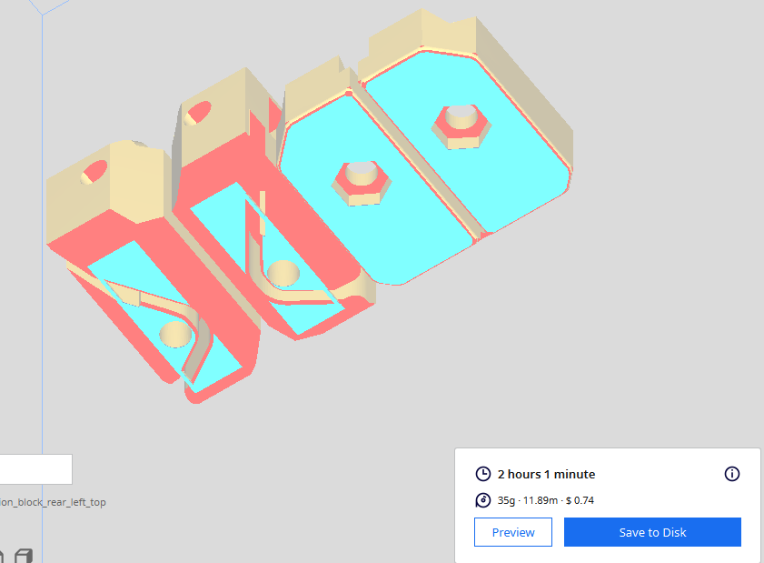

 # V1E LowRider 3 mod - Mid Belt Y Tensioner Block

Posted to [Printables](https://www.printables.com/model/425515-v1e-lowrider-3-mid-belt-y-tensioner-block) and V1Engineering [forum discussion](https://forum.v1engineering.com/t/lr3-mod-y-tensioner-block-going-topless-for-easy-mid-belt-access-goal-enable-faster-swap-between-big-and-little-table/33848).

## Purpose
Enables fast swapping of LR3 between different sizes tables, e.g. big 4'x8' and smaller 2'x4' table.  

## Files

- .3mf with all 4 parts oriented for printing:
  - [y-mid-belt-tension-blocks-rear.3mf](y-mid-belt-tension-blocks-rear.3mf)
- .STL file per part:
  - [y_tension_block_rear_left_bot.stl](y_tension_block_rear_left_bot.stl)
  - [y_tension_block_rear_left_top.stl](y_tension_block_rear_left_top.stl)
  - [y_tension_block_rear_right_bot.stl](y_tension_block_rear_right_bot.stl)
  - [y_tension_block_rear_right_top.stl](y_tension_block_rear_right_top.stl)
- Step/Fusion files if you want to remix/mod:
  - [y_tension_block_rear.f3d](y_tension_block_rear.f3d)
  - [y_tension_block_rear.step](y_tension_block_rear.step)

## Usage
Mod has top-bottom split Y tensioner blocks enabling clamping to middle of the belt.  So, the original Y tensioner block can always remain attached towards end of the belt.  Meanwhile the mid belt tensioner can be quickly added and removed.  I use wing nuts on my Mid Belt tensioner, ensure your your wiring isn't loose and snags on wing nutes if you decide to use them too.

Included both bottom and top models here, but I'm only using the bottom part in my build (see my Make pic(s)).  Am using M5 30mm bolt with M5 wing nuts (see pic below).  My print is tight enough to not need the top part, or wing nut even.  Early days still, so maybe the PLA will loosen up over time since my LR3 lives in an unconditioned space exposed to hot-cold weather cycles.  Will mount top part if/when I experience belt slipping out from the bottom part.

Existing quick release design is great, this block is only useful for folks wanting to mount their LR3 to different sized tables/surfaces.

[
[

(https://www.youtube.com/watch?v=9S7nP0F-bX8)

## Acknowledgements
- Remix/based-on [V1Engineering LowRider 3 CNC](https://docs.v1engineering.com/lowrider). 

## License/Sources
This work is licensed under a [Creative Commons (4.0 International License)
Attribution—Noncommercial—Share Alike](http://creativecommons.org/licenses/by-nc-sa/4.0/)

/v1e/... files are from https://www.v1engineering.com/logos and https://docs.v1engineering.com/.  Using per https://www.v1engineering.com/license/ which was shared under [Creative Commons Attribution-NonCommercial-ShareAlike 4.0 International License](https://creativecommons.org/licenses/by-nc-sa/4.0/).
